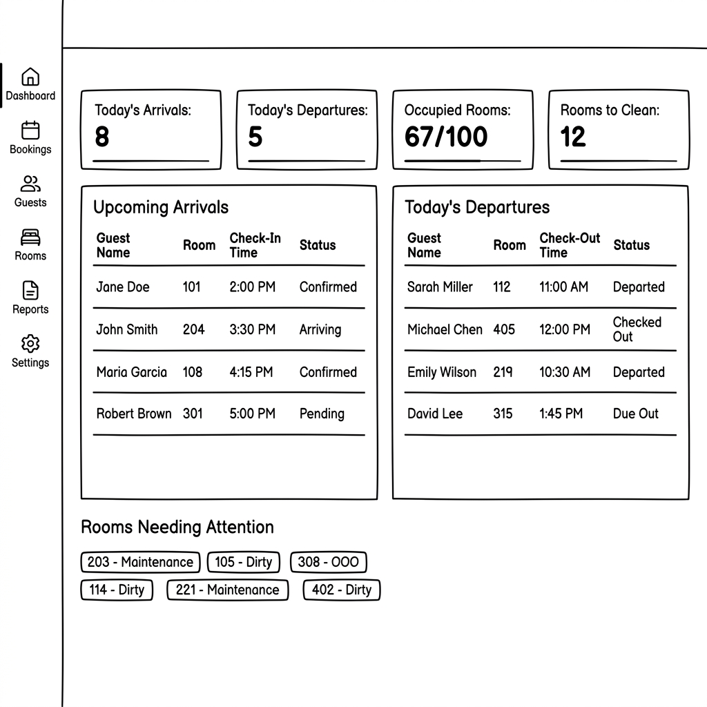
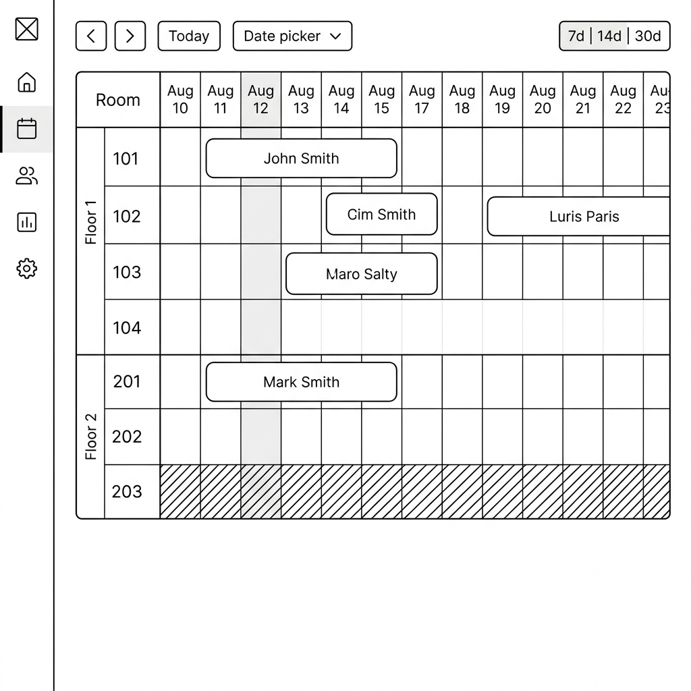

# Front-Desk Hotel Reservation System - Design Specification

## 1. Overview & Purpose
This document specifies the technical design for an internal Front-Desk Hotel Room Reservation and Management System for a single boutique hotel property (up to 100 rooms). The system provides front-desk staff and administrators with a unified dashboard to manage room availability, handle guest bookings, execute check-ins/check-outs, and monitor housekeeping statuses.

---

## 2. Understanding Summary
* **What is being built**: An internal front-desk reservation management web app.
* **Why it exists**: To streamline hotel operations, visually track room availability, assign guests to rooms, process stay lifecycles, and monitor housekeeping/maintenance states.
* **Target Users**: Internal hotel front-desk staff and administrators (5–15 concurrent users).
* **Core Capabilities**:
  1. Interactive room calendar/grid view (visual stay dates and availability).
  2. Reservation lifecycle management (create/edit bookings, check-in, check-out, cancel).
  3. Housekeeping & room status tracking (Clean, Dirty, Maintenance, Out of Order).
* **Key Constraints**: Single property scale (up to 100 rooms).
* **Explicit Non-Goals**:
  * Public guest-facing booking engine.
  * Payment gateway / guest billing & invoicing integration.
  * Multi-property chain management.

---

## 3. Key Assumptions
1. **Authentication**: Auth.js with credentials provider (email + password), encrypted JWT sessions, and a database-backed `session_version` revocation check. Auth.js does not support credentials sign-in with database-session strategy.
2. **Data & Concurrency**: Relational database (PostgreSQL) using transactional isolation to prevent double-booking room dates.
3. **Payments**: Financial transactions are handled offline or out-of-band for v1.
4. **Audit Trail**: Deferred to v2. No activity logging in v1.
5. **Guest Management**: Separate guest directory page with searchable records. Guests are linked to bookings, not created inline.

---

## 4. Decision Log

| # | Topic | Decision | Alternatives Considered | Rationale |
|---|---|---|---|---|
| 1 | Architecture Stack | Next.js (App Router + Server Actions) + PostgreSQL + **Drizzle ORM** | Decoupled React SPA + Express API; Serverless Headless API (PocketBase); Prisma | Single-repository TypeScript type safety, Server Components performance, fast SSR dashboard rendering. Drizzle chosen over Prisma for SQL-first control, lighter bundle, and superior TypeScript inference. |
| 2 | Room Calendar UI | Custom dual-axis CSS Grid Timeline View | Third-party fullcalendar bundle; static tabular list | Direct visual control over room stay spans, instant drag-and-drop/click affordances, zero heavy external library bloat. |
| 3 | UI/UX Aesthetics | Impeccable Product UI Register + UI/UX Pro Max Rules | Generic SaaS gradient templates; Glassmorphism | Professional tool design (Restrained Slate palette, 100% Lucide SVG icons, 150ms state motion, strict $\ge$4.5:1 contrast floor, 8–12px radii max). |
| 4 | Overlap Validation | Transactional server-side date bounds checking `[check_in, check_out)` | Client-side validation only; post-insert trigger check | Prevents race conditions and guarantees zero double-booking at the database tier. |
| 5 | Authentication | Auth.js credentials with encrypted JWT sessions and database revocation version | Auth.js database sessions; custom sessions | Auth.js explicitly rejects credentials sign-in with database-session strategy. Version checks preserve immediate revocation without replacing Auth.js security controls. |
| 6 | Guest Management | Separate guest directory page linked to bookings | Inline guest creation during booking; combined form | Enables returning guest lookup, prevents duplicate records, cleaner data model. |
| 7 | Device Strategy | Fully responsive (desktop + tablet + mobile) | Desktop-only; Desktop + tablet only | Staff may use tablets on the floor or phones for quick status checks. |
| 8 | Audit Trail | Deferred to v2 | Include in v1 | Keep v1 scope lean; revisit after core workflows stabilize. |

---

## 5. Route Map & Page Structure

| Route | Page | Access |
|---|---|---|
| `/login` | Staff login (email + password) | Public (unauthenticated) |
| `/dashboard` | Overview / Today's summary (arrivals, departures, occupancy stats) | `ADMIN`, `FRONT_DESK`, `HOUSEKEEPING` |
| `/dashboard/calendar` | Interactive room timeline grid (14/30-day view) | `ADMIN`, `FRONT_DESK` |
| `/dashboard/reservations` | Searchable reservation table (all bookings) | `ADMIN`, `FRONT_DESK` |
| `/dashboard/reservations/[id]` | Single reservation detail view | `ADMIN`, `FRONT_DESK` |
| `/dashboard/guests` | Searchable guest directory | `ADMIN`, `FRONT_DESK` |
| `/dashboard/guests/[id]` | Single guest profile + booking history | `ADMIN`, `FRONT_DESK` |
| `/dashboard/housekeeping` | Room status board (grid of all rooms with status badges) | `ADMIN`, `FRONT_DESK`, `HOUSEKEEPING` |
| `/dashboard/settings` | Room types, room setup, staff management | `ADMIN` only |
| `/404` | Not found | All |

### Layout Structure
* **Authenticated Shell**: Collapsible sidebar (left) + top bar with user avatar/role badge + main content area.
* **Sidebar Navigation Items**: Dashboard, Calendar, Reservations, Guests, Housekeeping, Settings (admin only).

---

## 6. Authentication & Authorization

### Auth Implementation
* **Library**: NextAuth.js (Auth.js) v5 with `CredentialsProvider`.
* **Session Strategy**: Encrypted JWT session with `session_version` copied into the token and checked against the staff record for immediate server-side revocation.
* **Password Hashing**: `bcrypt` with 12 salt rounds.
* **Middleware**: Next.js middleware protects all `/dashboard/*` routes; redirects unauthenticated requests to `/login`.

### Role Permissions Matrix

| Action | `ADMIN` | `FRONT_DESK` | `HOUSEKEEPING` |
|---|:---:|:---:|:---:|
| View dashboard overview | ✅ | ✅ | ✅ |
| View/browse calendar | ✅ | ✅ | ❌ |
| Create/edit reservations | ✅ | ✅ | ❌ |
| Check-in / check-out guests | ✅ | ✅ | ❌ |
| Cancel reservations | ✅ | ✅ | ❌ |
| View/search guest directory | ✅ | ✅ | ❌ |
| Create/edit guest records | ✅ | ✅ | ❌ |
| View housekeeping board | ✅ | ✅ | ✅ |
| Update room status (clean/dirty) | ✅ | ✅ | ✅ |
| Set room to maintenance/OOO | ✅ | ✅ | ❌ |
| Manage room types & rooms | ✅ | ❌ | ❌ |
| Manage staff accounts | ✅ | ❌ | ❌ |

---

## 7. System Architecture & Schema Design

### Entities & Data Tables

#### `User` (Staff/Admin)
* `id`: UUID (Primary Key)
* `name`: String
* `email`: String (Unique)
* `password_hash`: String
* `role`: Enum (`ADMIN`, `FRONT_DESK`, `HOUSEKEEPING`)
* `created_at`: Timestamp

#### `RoomType`
* `id`: UUID (Primary Key)
* `name`: String (e.g., "Standard King", "Deluxe Suite")
* `base_capacity`: Integer
* `description`: Text

#### `Room`
* `id`: UUID (Primary Key)
* `room_number`: String (Unique, e.g., "101", "102")
* `room_type_id`: UUID (Foreign Key -> `RoomType.id`)
* `floor`: Integer
* `status`: Enum (`CLEAN`, `DIRTY`, `MAINTENANCE`, `OUT_OF_ORDER`)

#### `Guest`
* `id`: UUID (Primary Key)
* `full_name`: String
* `email`: String (nullable — not all walk-in guests provide email)
* `phone`: String
* `id_number`: String (Passport / National ID, Unique)
* `notes`: Text (optional staff notes)
* `created_at`: Timestamp

**Deduplication Rule**: On reservation creation, staff searches the guest directory first. If a match is found by `id_number` or `full_name + phone`, the existing guest record is linked. New guest records are created only from `/dashboard/guests`.

#### `Reservation`
* `id`: UUID (Primary Key)
* `booking_code`: String (Unique, auto-generated, e.g., `RES-10042`)
* `guest_id`: UUID (Foreign Key -> `Guest.id`)
* `room_id`: UUID (Foreign Key -> `Room.id`)
* `check_in_date`: Date
* `check_out_date`: Date
* `status`: Enum (`CONFIRMED`, `CHECKED_IN`, `CHECKED_OUT`, `CANCELLED`)
* `notes`: Text (optional staff notes)
* `created_by`: UUID (Foreign Key -> `User.id`)
* `created_at`: Timestamp
* `updated_at`: Timestamp

**Booking Code Generation**: Sequential integer counter, zero-padded to 5 digits, prefixed with `RES-`. Example: `RES-00001`, `RES-00042`, `RES-10503`. The counter never resets. Implementation: a database sequence or `MAX(id) + 1` query inside the creation transaction.

---

## 8. Dashboard UI & UX Specifications (Impeccable & UI/UX Pro Max)

### Wireframe References

**Dashboard Overview Page:**


**Room Calendar Grid:**


### Design System Tokens
* **Color Palette (Restrained Strategy)**:
  * Surface: `#F8FAFC` background with `#FFFFFF` card containers and `#E2E8F0` 1px borders.
  * Ink: `#0F172A` headings/body text, `#475569` secondary text ($\ge$4.5:1 contrast floor).
  * Status Semantics:
    * `CONFIRMED`: Indigo-600 (`#4F46E5`)
    * `CHECKED_IN`: Emerald-600 (`#059669`)
    * `CHECKED_OUT`: Slate-500 (`#64748B`)
    * `DIRTY`: Amber-600 (`#D97706`)
    * `MAINTENANCE`: Rose-600 (`#E11D48`)
    * `OUT_OF_ORDER`: Slate-800 (`#1E293B`)
    * `CLEAN`: Teal-600 (`#0D9488`)
    * `CANCELLED`: Slate-400 (`#94A3B8`, strikethrough text)

### Typography & Component Mechanics
* **Font Family**: Single unified sans-serif stack (`Inter`, `system-ui`). Fixed rem scale (1.125 ratio).
* **Icons**: 100% Lucide SVG icons (strict ban on emojis as UI icons).
* **Interactions**: `cursor-pointer` and 150ms snappy transitions (`transition-colors duration-150`) on all interactive rows and reservation blocks.
* **Modals & Drawers**: Portaled native `<dialog>` modals to avoid stacking context clipping inside overflow grids.
* **Border Radius**: 8px cards, 6px inputs/buttons, 4px badges. No over-rounding.

### Reusable Component Hierarchy

These are the shared components that appear across multiple pages:

| Component | Props | Used In |
|---|---|---|
| `<StatusBadge status variant?>` | `status`: any reservation or room status enum. `variant`: `'dot'` (small colored dot + text) or `'pill'` (full colored pill). | Calendar, Reservations table, Housekeeping board, Guest profile |
| `<GuestSearchCombobox onSelect>` | Debounced search input with dropdown results from guest directory. Returns selected `guest_id`. | New Booking modal, Reservation edit form |
| `<RoomSelector floorFilter? typeFilter? onSelect>` | Dropdown or grid showing available rooms, filterable by floor and room type. Grays out occupied/maintenance rooms. | New Booking modal, Reassign Room flow |
| `<DateRangePicker startDate endDate onChange>` | Two date inputs with calendar popover. Enforces `check_out > check_in`. Highlights today. | New Booking modal, Reservation edit, Reservation filters |
| `<DataTable columns data pagination sorting filters>` | Generic server-side paginated table with sortable headers, filter bar, and empty state slot. | Reservations page, Guest directory |
| `<ConfirmDialog title message onConfirm onCancel>` | Portaled confirmation modal for destructive actions (cancel booking, force dirty check-in). | Reservation actions, Room status changes |
| `<StatCard label value icon trend?>` | Single metric card with icon, large number, and optional trend indicator. | Dashboard overview |
| `<RoomStatusCard roomNumber status onClick>` | Compact card showing room number and colored status badge. Click triggers status change dropdown. | Housekeeping board |

### Responsive Breakpoint Strategy

| Breakpoint | Layout | Calendar Behavior |
|---|---|---|
| **Desktop** (≥1280px) | Sidebar expanded + full timeline grid | 14 or 30-day horizontal axis, rooms on vertical axis |
| **Tablet** (768–1279px) | Sidebar collapsed to icon rail, content fills width | 7-day view, horizontal scroll for overflow |
| **Mobile** (<768px) | Bottom tab navigation replaces sidebar entirely | Calendar switches to a vertical card-based daily list (one day at a time, swipe to navigate dates) |

### Dashboard Overview Page (`/dashboard`)

#### Top Row: 4 Stat Cards (horizontal, equal width)
1. **Today's Arrivals**: Count of reservations with `check_in_date = today` and `status = CONFIRMED`. Icon: `LogIn`.
2. **Today's Departures**: Count of reservations with `check_out_date = today` and `status = CHECKED_IN`. Icon: `LogOut`.
3. **Occupied Rooms**: `{checked_in_count} / {total_rooms}` with a subtle progress bar fill. Icon: `BedDouble`.
4. **Rooms to Clean**: Count of rooms with `status = DIRTY`. Icon: `Sparkles`.

#### Middle Row: Two Side-by-Side Panels
* **Left Panel — "Upcoming Arrivals"**: Table showing today's + tomorrow's expected check-ins. Columns: Guest Name, Room Number, Check-In Date, Status. Click row → opens reservation detail. Max 10 rows, link to full reservations page if more.
* **Right Panel — "Today's Departures"**: Table showing today's expected check-outs. Columns: Guest Name, Room Number, Check-Out Date, Status. Click row → opens reservation detail.

#### Bottom Row: "Rooms Needing Attention"
* Compact grid of `<RoomStatusCard>` components showing only rooms with `DIRTY`, `MAINTENANCE`, or `OUT_OF_ORDER` status. Click → opens status change dropdown. If all rooms are clean, show empty state: "All rooms are clean ✓".

### Room Calendar Interaction Details (`/dashboard/calendar`)

#### Grid Structure (CSS Grid)
* **Column width**: Each date column is `minmax(48px, 1fr)` — minimum 48px ensures room for 1-night blocks.
* **Row height**: Fixed 40px per room row. Floor header rows are 32px with bold text and collapse toggle.
* **Sticky elements**: Room number column (left) and date header row (top) are `position: sticky` so they remain visible during scroll.

#### Navigation
* **Date Controls**: Left/right arrow buttons to shift the visible window by 1 day. A "Today" button snaps back to the current date. A date-picker dropdown for jumping to any date.
* **View Toggle**: Switch between 7-day, 14-day, and 30-day views.
* **Keyboard**: Arrow keys shift dates, `T` key returns to today.

#### Reservation Block Interactions
* **Click empty cell range** → Opens New Booking modal, pre-filled with room + date range.
* **Click existing reservation block** → Opens Reservation Detail drawer (right-side panel) with:
  * Guest name, booking code, stay dates, room info.
  * Action buttons: *Check-In*, *Check-Out*, *Edit*, *Reassign Room*, *Cancel*.
* **Hover reservation block** → Tooltip preview showing guest name, booking code, stay dates.
* **No drag-to-extend in v1** — stay modifications go through the Edit form to enforce overlap validation server-side.

#### Visual Encoding
* Reservation blocks are colored bars spanning the date range with rounded ends (4px radius). Text inside the bar shows the guest's last name (truncated with ellipsis if the block is too narrow for 1–2 night stays).
* Room rows are grouped by floor, with a collapsible floor header.
* Today's column has a subtle highlighted background stripe (`bg-indigo-50`).
* Rooms with `MAINTENANCE` or `OUT_OF_ORDER` status show a hatched overlay on the entire row.

### Housekeeping Status Board (`/dashboard/housekeeping`)

* **Layout**: Grid of `<RoomStatusCard>` components, grouped by floor. Each card shows room number + colored status badge.
* **Interaction**: Click card → dropdown with status options (`CLEAN`, `DIRTY`, `MAINTENANCE`, `OUT_OF_ORDER`). Selection triggers `updateRoomStatus` server action.
* **Filter tabs**: All / Dirty / Maintenance / Out of Order (default: show all).
* **Mobile**: Cards stack in a single column, grouped by floor with sticky floor headers.

### Settings Page (`/dashboard/settings`) — Admin Only

#### Tab 1: Room Types
* Table: Name, Capacity, Description, Room Count, Actions (Edit / Delete).
* "Add Room Type" button opens form modal: `name` (required), `base_capacity` (required, number), `description` (optional textarea).
* Delete is blocked if any rooms of that type exist (show warning: "Remove or reassign 15 rooms first").

#### Tab 2: Rooms
* Table: Room Number, Floor, Room Type, Status, Actions (Edit / Delete).
* "Add Room" button opens form modal: `room_number` (required, unique validation), `floor` (required, number), `room_type_id` (required, dropdown), `status` (default: `CLEAN`).
* Bulk actions: Select multiple rooms → set status.

#### Tab 3: Staff Management
* Table: Name, Email, Role, Created At, Actions (Edit / Delete).
* "Add Staff" button opens form modal: `name`, `email`, `password` (min 8 chars), `role` (dropdown: `ADMIN`, `FRONT_DESK`, `HOUSEKEEPING`).
* Cannot delete your own account. Cannot delete the last `ADMIN`.

### Guest Directory (`/dashboard/guests`)

* **Table columns**: Full Name, Phone, Email, ID Number, Total Stays (count), Last Stay Date.
* **Search**: Full-text search across `full_name`, `email`, `phone`, `id_number`.
* **Actions**: Click row → Guest profile page with full booking history.
* **New Guest**: "Add Guest" button opens a form modal with required fields (`full_name`, `phone`, `id_number`) and optional fields (`email`, `notes`).

### Reservation Search (`/dashboard/reservations`)

* **Table columns**: Booking Code, Guest Name, Room Number, Check-In, Check-Out, Status, Created At.
* **Filters**:
  * Status dropdown: All / Confirmed / Checked-In / Checked-Out / Cancelled.
  * Date range picker: Filter by check-in date range.
  * Text search: Across booking code, guest name.
* **Sorting**: Clickable column headers (default: check-in date descending).
* **Pagination**: Server-side, 25 rows per page with page controls.

---

## 9. Server Action Contracts

### `createReservation`
```typescript
// Input
type CreateReservationInput = {
  guest_id: string;       // UUID — must exist in Guest table
  room_id: string;        // UUID — must exist in Room table
  check_in_date: string;  // ISO date "YYYY-MM-DD"
  check_out_date: string; // ISO date "YYYY-MM-DD"
  notes?: string;
}

// Output
type CreateReservationResult =
  | { success: true; reservation: Reservation }
  | { success: false; error: "OVERLAP"; conflicting_booking: string }
  | { success: false; error: "INVALID_DATES" | "GUEST_NOT_FOUND" | "ROOM_NOT_FOUND" }
```

### `updateReservationStatus`
```typescript
// Input
type UpdateReservationStatusInput = {
  reservation_id: string;
  new_status: "CHECKED_IN" | "CHECKED_OUT" | "CANCELLED";
  force_dirty_room?: boolean; // Override clean-room guard for check-in
}

// Output
type UpdateReservationStatusResult =
  | { success: true; reservation: Reservation }
  | { success: false; error: "ROOM_NOT_CLEAN"; room_status: RoomStatus }
  | { success: false; error: "INVALID_TRANSITION" } // e.g., CANCELLED → CHECKED_IN
  | { success: false; error: "NOT_FOUND" }
```

### `updateRoomStatus`
```typescript
// Input
type UpdateRoomStatusInput = {
  room_id: string;
  new_status: "CLEAN" | "DIRTY" | "MAINTENANCE" | "OUT_OF_ORDER";
}

// Output
type UpdateRoomStatusResult =
  | { success: true; room: Room }
  | { success: false; error: "ROOM_OCCUPIED" } // Can't set MAINTENANCE while CHECKED_IN guest
  | { success: false; error: "NOT_FOUND" }
```

### `createGuest`
```typescript
// Input
type CreateGuestInput = {
  full_name: string;
  phone: string;
  id_number: string;
  email?: string;
  notes?: string;
}

// Output
type CreateGuestResult =
  | { success: true; guest: Guest }
  | { success: false; error: "DUPLICATE_ID_NUMBER"; existing_guest_id: string }
```

### Valid Reservation Status Transitions
```
CONFIRMED  → CHECKED_IN   (check-in)
CONFIRMED  → CANCELLED    (cancel before arrival)
CHECKED_IN → CHECKED_OUT  (check-out)
CHECKED_IN → CANCELLED    (early departure / error correction)
```
All other transitions are rejected with `INVALID_TRANSITION`.

---

## 10. Data Flow & Validation Rules

### Overlap Check Query (Server Action)
Before confirming a booking for `room_id`, the system checks for overlaps:
$$\text{Existing Check In} < \text{New Check Out} \quad \text{AND} \quad \text{Existing Check Out} > \text{New Check In}$$

If matches exist with status `CONFIRMED` or `CHECKED_IN`, creation is rejected with a clear field error identifying the conflicting booking code.

### Housekeeping Workflow
* **Check-Out Trigger**: Changing a reservation status to `CHECKED_OUT` automatically transitions `Room.status` to `DIRTY`.
* **Clean Room Safety Guard**: Checking in a guest to a `DIRTY` or `MAINTENANCE` room returns `ROOM_NOT_CLEAN` error. The UI displays a confirmation dialog; if staff confirms, the action is retried with `force_dirty_room: true`.
* **Maintenance Block**: Setting a room to `MAINTENANCE` or `OUT_OF_ORDER` while a guest is checked in returns `ROOM_OCCUPIED`.

---

## 11. Empty, Loading & Error States

Every page and component must handle these three states explicitly:

### Loading States
* **Tables** (Reservations, Guests, Settings): Skeleton rows — 5 rows of animated pulse bars matching column widths.
* **Stat Cards** (Dashboard overview): Skeleton pulse on the number value, icon and label remain static.
* **Calendar Grid**: Skeleton pulse on reservation blocks; room numbers and date headers render immediately.
* **Housekeeping Board**: Skeleton pulse on room cards.

### Empty States
| Page / Component | Empty State Message | Action |
|---|---|---|
| Dashboard — Upcoming Arrivals | "No arrivals expected today or tomorrow." | — |
| Dashboard — Today's Departures | "No departures scheduled for today." | — |
| Dashboard — Rooms Needing Attention | "All rooms are clean." (with checkmark icon) | — |
| Calendar Grid (no reservations visible) | "No reservations in this date range. Click any cell to create one." | Click cell → New Booking |
| Reservations Table (no results) | "No reservations found matching your filters." | "Clear filters" button |
| Guest Directory (no results) | "No guests found. Add your first guest to get started." | "Add Guest" button |
| Housekeeping — Filtered (no rooms match) | "No rooms with this status." | "Show all" link |
| Settings — Room Types (empty) | "No room types defined. Create one to start adding rooms." | "Add Room Type" button |
| Settings — Rooms (empty) | "No rooms added yet. Create a room type first, then add rooms." | Link to Room Types tab |
| Settings — Staff (just the admin) | "You're the only staff member. Invite your team to get started." | "Add Staff" button |

### Error States
* **Form Validation Errors**: Inline, below each field, in Rose-600 text. Fields with errors get a Rose-600 border.
* **Server Action Errors** (`OVERLAP`, `ROOM_NOT_CLEAN`, etc.): Displayed as a dismissible alert banner at the top of the modal/form, with specific message text:
  * `OVERLAP`: "Room {room_number} is already booked from {date} to {date} ({conflicting_booking_code}). Please choose different dates or another room."
  * `ROOM_NOT_CLEAN`: "Room {room_number} is currently {status}. Check in anyway?" with Confirm/Cancel buttons.
  * `INVALID_TRANSITION`: "Cannot change status from {current} to {new}."
  * `DUPLICATE_ID_NUMBER`: "A guest with this ID number already exists. View existing record?" with link.
  * `ROOM_OCCUPIED`: "Room {room_number} has an active check-in. Check out the guest first."
* **Network / Unexpected Errors**: Toast notification (top-right corner, auto-dismiss after 5 seconds): "Something went wrong. Please try again."
* **404 Page**: Centered message "Page not found" with a "Back to Dashboard" link.

---

## 12. Seed Data Specification

The development seed script populates the database with realistic test data:

### Room Types (3)
| Name | Capacity | Description |
|---|---|---|
| Standard Twin | 2 | Two single beds, city view, 25m² |
| Deluxe King | 2 | King bed, balcony, 35m² |
| Suite | 4 | Separate living area, king bed, sofa bed, 55m² |

### Rooms (100 across 4 floors)
| Floor | Room Numbers | Room Type Distribution |
|---|---|---|
| 1 | 101–125 (25 rooms) | 15 Standard Twin, 8 Deluxe King, 2 Suite |
| 2 | 201–225 (25 rooms) | 15 Standard Twin, 8 Deluxe King, 2 Suite |
| 3 | 301–325 (25 rooms) | 10 Standard Twin, 12 Deluxe King, 3 Suite |
| 4 | 401–425 (25 rooms) | 5 Standard Twin, 12 Deluxe King, 8 Suite |

### Staff Accounts (5)
| Name | Email | Role | Password |
|---|---|---|---|
| Admin User | admin@hotel.local | ADMIN | admin123 |
| Front Desk 1 | frontdesk1@hotel.local | FRONT_DESK | staff123 |
| Front Desk 2 | frontdesk2@hotel.local | FRONT_DESK | staff123 |
| Housekeeper 1 | housekeeper1@hotel.local | HOUSEKEEPING | staff123 |
| Housekeeper 2 | housekeeper2@hotel.local | HOUSEKEEPING | staff123 |

### Sample Guests (10)
Generate 10 fake guest records with realistic names, phone numbers, and ID numbers.

### Sample Reservations (20)
Generate 20 reservations spread across the next 30 days with a mix of statuses:
* 8 × `CONFIRMED` (future check-ins)
* 5 × `CHECKED_IN` (currently staying)
* 5 × `CHECKED_OUT` (recent departures)
* 2 × `CANCELLED`

---

## 13. Implementation & Verification Roadmap
1. **Database & ORM Setup**: Define Drizzle ORM schema, run `drizzle-kit push` migrations, execute seed script with data from Section 12.
2. **Authentication**: Configure NextAuth.js v5 with credentials provider, middleware route protection, and role-based access checks per Section 6 permissions matrix.
3. **Server Actions**: Build atomic transaction helpers for `createReservation`, `updateReservationStatus`, `updateRoomStatus`, and `createGuest` with typed contracts from Section 9.
4. **Reusable Components**: Build shared components from the Component Hierarchy table in Section 8 (`StatusBadge`, `GuestSearchCombobox`, `RoomSelector`, `DateRangePicker`, `DataTable`, `ConfirmDialog`, `StatCard`, `RoomStatusCard`).
5. **Dashboard Shell**: Implement responsive layout (sidebar / icon rail / bottom tabs) with navigation per Section 8 breakpoint strategy.
6. **UI Pages**: Build in order:
   a. Login page.
   b. Dashboard overview (stat cards + arrivals/departures + rooms needing attention).
   c. Room calendar timeline view (CSS Grid, sticky headers, reservation blocks).
   d. Reservation table with search/filters/pagination.
   e. Guest directory with search + guest profile.
   f. Housekeeping status board (room cards grouped by floor).
   g. Settings page (3 tabs: Room Types, Rooms, Staff Management).
7. **States**: Implement all loading skeletons, empty states, and error messages from Section 11.
8. **Validation & Testing**: Verify overlap rejection, same-day turnaround bookings, status transition guards, role-based access denial, responsive breakpoints at 375/768/1280px, and all empty/error states.
